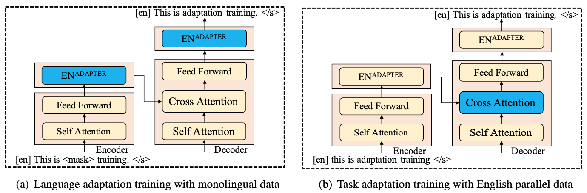

# [Multilingual Pre-training with Language and Task Adaptation for Multilingual Text Style Transfer (ACL 2022)](http://arxiv.org/abs/2203.08552)

## Overview


In view of the general scarcity of parallel data, we propose a modular approach for multilingual 
formality transfer, which consists of two training strategies that target adaptation to both language and task. 
Our approach achieves competitive performance without monolingual task-specific parallel data and can be applied 
to other style transfer tasks as well as to other languages.

## Dataset
- [XFORMAL](https://github.com/Elbria/xformal-FoST): informal text (0) <-> formal text (1), e.g. train.0 <-> train.1.
- [News-crawl](http://data.statmt.org/news-crawl/): Language-specific generic non-parallel data.

## Quick Start
### Step 1: Language Adaptation Training
```bash
# en_XX, it_IT, fr_XX, pt_XX
python train_lang_adap.py -dataset news-crawl -lang en_XX
```

### Step 2: Task Adaptation Training
```bash
# en_XX, it_IT, fr_XX, pt_XX
python train_task_adap.py -dataset xformal -lang en_XX
```

### Step 3: Inference

```bash
# ADAPT + EN data (it_IT, fr_XX, pt_XX)
python infer_en_data.py -dataset xformal -lang it_IT -style 0 

# ADAPT + EN cross-attn (it_IT, fr_XX, pt_XX)
python infer_en_attn.py -dataset xformal -lang it_IT -style 0    
```

## Citation
```
@inproceedings{lai-etal-2022-multilingual,
    title = "Multilingual Pre-training with Language and Task Adaptation for Multilingual Text Style Transfer",
    author = "Lai, Huiyuan  and
      Toral, Antonio  and
      Nissim, Malvina",
    booktitle = "Proceedings of the 60th Annual Meeting of the Association for Computational Linguistics (Volume 2: Short Papers)",
    month = may,
    year = "2022",
    address = "Dublin, Ireland",
    publisher = "Association for Computational Linguistics",
    url = "https://aclanthology.org/2022.acl-short.29",
    pages = "262--271"
}
```
